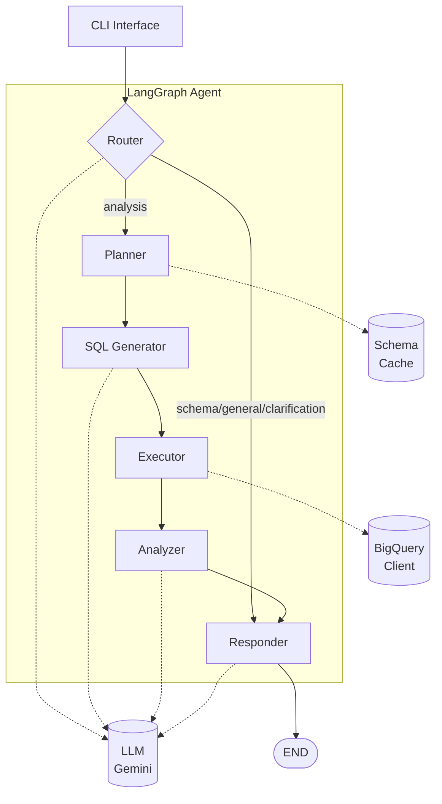

# Architecture

The Data Analysis Agent follows a pipeline pattern with conditional routing at the entry point. Instead of a multi-agent supervisor patterns where the orchestrator delegates to worker agents, the current system uses a sequential flow where each node transforms the state and passes it to the next. It is easier to understand, debug, and extend the system for this case.



The architecture consists of six nodes:

- Router: the entry point that classifies incoming queries into types (schema, analysis, general, clarification). It uses an LLM to determine the query type.
- Planner: creates a step-by-step execution plan. It considers the available schema and the user's intent.
- SQL Generator: converts natural language to BigQuery SQL
- Executor: runs SQL against BigQuery with retry logic. When a query fails, the Executor sends both the SQL and error message to the LLM for correction, then retries.
- Analyzer: takes raw query results and extracts meaningful insights.
- Responder: formats everything into a user-friendly response.

The Router's classification creates conditional routing:

Analysis Path (full pipeline):
```
Router → Planner → SQL Generator → Executor → Analyzer → Responder → END
```

Direct Response Path (schema, general, clarification):
```
Router → Responder → END
```
